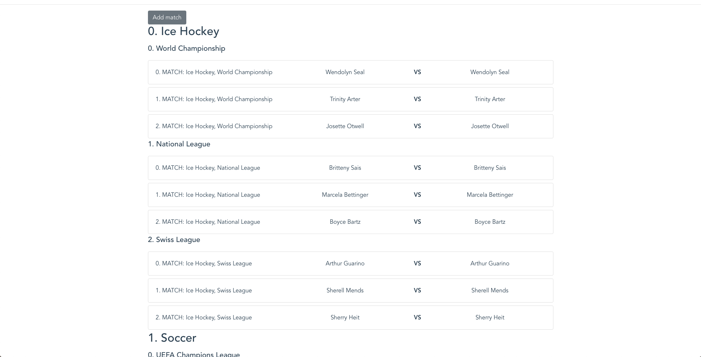

# Test task for ArcaneBet front-end developer

We have fixtures with a list of sports, tournaments and matches. Every entity
has a position number (0, 1, 2, etc...).
Render matches hierarchically `Sport -> Tournaments -> Macthes`. Every entity inside
group must be sorted by position in ascending order.

Also, finish match form component to have ability to add new match in list.
Required match fields are:

* Name
* First competitor name
* Second competitor name
* Tournament
* Position

After adding new match list must be automatically re-sorted
